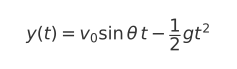
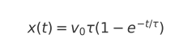
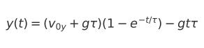

# Interactive Projectile Motion Simulator  
**Term Project – B11504118**

---

## 1. 程式功能與技術原理（Function and Technical Principles）

本程式實作可視覺化拋體運動的互動模擬工具，包含：

1. 無空氣阻力模型（理想拋物線）  
2. 線性空氣阻力模型（阻力 ∝ 速度）

使用者可透過滑桿調整：

- 初速 \(v_0\)
- 發射角度 \(\theta\)
- 阻力係數 \(k\)

並即時觀察軌跡變化。


1.1 無空氣阻力模型
拋體運動方程式如下：

<p align="center">
  
</p>

<p align="center">
  
</p>

其中：
- \(v_0\)：初速度  
- \(\theta\)：發射角度  
- \(g\)：重力加速度  

1.2 線性空氣阻力模型
假設阻力與速度成正比：

<p align="center">
  
</p>

定義時間常數：

<p align="center">
  
</p>

其解析解如下：

<p align="center">
  
</p>

<p align="center">
  
</p>


## 2. 使用方式（Usage Instructions）

2.1 安裝必要套件

若未安裝 Matplotlib，請執行：
```
pip install matplotlib
```
2.2 執行程式
```
python3 B11504118_term\ project.py
```
2.3 互動操作

執行後會開啟視窗，內含三組滑桿：

| 滑桿         | 說明              |
| ----------- | --------------- |
| v0 (m/s)    | 調整初速（1–100 m/s） |
| Angle (deg) | 調整發射角度（1–89°）   |
| Drag k      | 調整線性空氣阻力（0–1）   |


## 3.Program Structure

```
trajectory_no_drag()：計算無空氣阻力情況的拋體軌跡
                    ↓

trajectory_linear_drag()：計算線性空氣阻力解析解
                    ↓

interactive_plot()：建立主介面、滑桿與更新函式
                    ↓

main entry：呼叫 interactive_plot()
                  
```


## 4.Development Process
開發過程主要包含以下階段：
```
1. 模型推導與測試

驗證理想拋體運動方程式

整理並實作線性阻力模型的解析解

測試不同參數下是否生成合理軌跡

2. 圖形繪製

以 Matplotlib 繪製初步軌跡

測試是否會出現 NaN、軌跡斷裂等情況

3. 互動功能實作

使用 matplotlib.widgets.Slider 建立滑桿

實作更新函式，在參數變動時重新計算軌跡

4. 邊界與例外處理

當 y(t) < 0（落地）時以 NaN 隱藏後段曲線

使用 ax.relim() 與 ax.autoscale_view() 讓圖形自動調整

5. 介面與程式整理

調整滑桿位置避免遮擋圖形

加上標題、座標軸標示與圖例
```

## 5.References
普通物理教科書：拋體運動章節

R. Fitzpatrick, Newtonian Dynamics, University of Texas

Wikipedia: Drag Equation（線性阻力模型部分）

